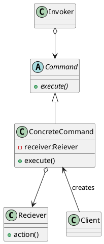

### コマンドパターン

* 問題
  - 作業が増える度に下記if文が増えていく。
    ```cpp
    public class Beaker {

    ～～～

        //各実験を行うメソッド
        public void experiment(int param) {
            if (param == ADD_SALT) {
                //食塩を1gずつ加えて飽和食塩水を作る実験をする場合
                //完全に溶けている間は食塩を加える
                while (isMelted()) {
                    this.addSalt(1); //食塩を1g入れる
                    this.mix(); //かき混ぜる
                }
                //実験結果をノートに記述する
                System.out.println("食塩を1gずつ加える実験");
                this.note();
            } else if (param == ADD_WATER) {
                //水を10gずつ加えて飽和食塩水を作る実験をする場合
                //溶け残っている間は水を加える
                while (!isMelted()) {
                    this.addWater(10); //水を10g入れる
                    this.mix(); //かき混ぜる
                }
                //実験結果をノートに記述する
                System.out.println("水を10gずつ加える実験");
                this.note();
            }
        }
    ```
    - 拡張した場合
        ```cpp
        //実験セット
        public class Beaker {
        ・・・
            public static final int MAKE_SALT_WATER = 3; //食塩水を作る場合
            
            //各実験を行うメソッド
            public void experiment(int param) {
                if (param == ADD_SALT) {
                    ・・・
                } else if (param == ADD_WATER) {
                    ・・・
                } else if (param == MAKE_SALT_WATER) {
                    //食塩水を作る実験
                    this.mix();
                    //濃度をはかり、ノートに記述する
                    System.out.println("食塩水を作る実験");
                    this.note();
                }
            }
        ・・・
        ```
    - クラス図
    ```plantuml
    @startuml
    abstract Command {
        {field} #beaker : Beaker
        {abstract} +execute()
        {method} +setBeaker(beaker : Beaker)
    }
    class AddSaltCommand {
        {method} +execute()
    }
    class AddWaterCommand {
        {method} +execute()
    }
    class MakeSaltWaterCommand {
        {method} +execute()
    }
    class Beaker {
        {method} +addWater(water : double)
        {method} +addSalt(salt : double)
        {method} +mix()
        {method} +isMelted() : bool
    }
    class Student

    Command <|-- AddSaltCommand
    Command <|-- AddWaterCommand
    Command <|-- MakeSaltWaterCommand

    Student --> Command
    Beaker <--o Command

    @enduml
    ```

* クラス図
