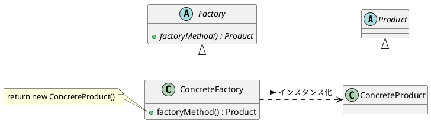

### FactoryMethodパターン

* 概要
  - オブジェクトを __生成する側__ と __利用する側__ を分けて定義する考え
  - 将来起こりえる変更をあらかじめ分離でき保守性を保つ
  - どのクラスをインスタンス化するかは __サブクラス__ に決定させる

* クラス図

```plantuml
@startuml

' クラス定義
abstract Product
class ConcreteProduct extends Product

abstract Factory {
    {abstract} +factoryMethod() : Product
}
class ConcreteFactory extends Factory {
    {method} +factoryMethod() : Product
}
note left of ConcreteFactory::factoryMethod
    return new ConcreteProduct()
end note

' 関係定義
ConcreteFactory .right.> ConcreteProduct : インスタンス化 >

@enduml
```