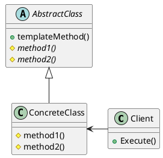

### TemplateMethodパターン

* 概要
  - スーパークラスで処理の大枠決めとく
  - 詳細な実装をサブクラスで実装する

* クラス図

```plantuml
@startuml
class Client {
    {method} +Execute()
}
abstract AbstractClass {
    {method} +templateMethod()
    {abstract} #method1()
    {abstract} #method2()
}
class ConcreteClass extends AbstractClass {
    {method} #method1()
    {method} #method2()
}

ConcreteClass <-right- Client

@enduml
```